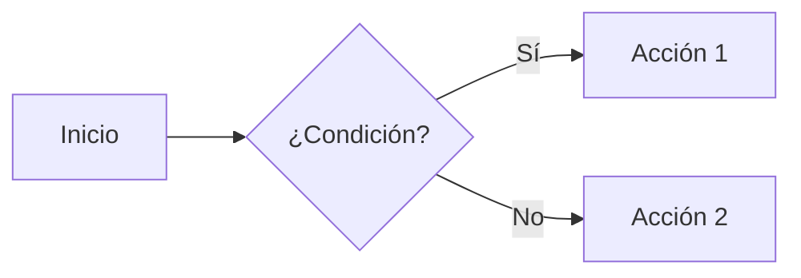

# Markdown básico y avanzado disponible

Fuente: `https://ayuda.ahora.es/help/1.0/Components/BasicMarkdown/` y
`.../Components/AdvancedMarkdown/`. Todas estas extensiones ya están habilitadas en
`markdown_extensions` de `mkdocs.yml` en este proyecto.

## Básico

```markdown
# Reservado para el título del artículo (H1, uno solo por página)
## Sección (aparece en el submenú)
### Subsección (aparece anidada en el submenú)
#### Nivel 4+ (NO aparece en el submenú, úsalo con moderación)

**negrita**   *cursiva*   ***negrita y cursiva***   ~~tachado~~   `código en línea`

- Lista sin orden
  - Sub-elemento

1. Lista numerada
   1. Sub-paso

[Texto del enlace](https://www.ejemplo.com)
[Ir a otro artículo](../OtraCarpeta/OtroArticulo.md)


> Cita en bloque

| Columna 1 | Columna 2 |
|-----------|-----------|
| Dato      | Dato      |

| Izquierda | Centro | Derecha |
|:----------|:------:|--------:|
| Texto     | Texto  | Texto   |

---  (regla horizontal)

- [x] Tarea completada
- [ ] Tarea pendiente
```

- Los enlaces internos son sensibles a mayúsculas y a los espacios (ver
  `estructura-proyecto.md`).
- Salto de línea sin nuevo párrafo: terminar la línea con dos espacios.
- Se permite HTML embebido si es necesario, pero con moderación para mantener la
  coherencia visual del resto del sitio.

## Avisos / admonitions

```markdown
!!! note "Título opcional"
    Contenido de la nota. Puede tener varias líneas.
```

Tipos disponibles: `note`, `info`, `tip`, `success`, `warning`, `danger`, `example`,
`question`.

Colapsables:

```markdown
??? note "Clic para expandir"
    Oculto por defecto.

???+ warning "Expandido por defecto"
    Visible por defecto, se puede colapsar.
```

## Pestañas

```markdown
=== "Opción A"
    Contenido de la pestaña A.

=== "Opción B"
    Contenido de la pestaña B.
```

Muy útil para mostrar el mismo paso en distintos contextos (p. ej. distintas
versiones o distintos navegadores), no solo para código.

## Bloques de código avanzados

Con título de archivo:

````markdown
```python title="mi_script.py"
def calcular_suma(a, b):
    return a + b
```
````

Con líneas resaltadas:

````markdown
```python hl_lines="2 3"
def ejemplo():
    linea_resaltada_1 = "..."
    linea_resaltada_2 = "..."
```
````

Sin etiqueta de lenguaje: ver clase `no-language` en `componentes-personalizados.md`.

## Iconos y emojis

```markdown
:smile: :rocket: :warning:
:material-account-circle: Usuario
:material-alert-circle: Alerta
```

## Botones estilo Material

```markdown
[Botón primario](#){ .md-button }
[Botón destacado](#){ .md-button .md-button--primary }
```

(Para un botón con apariencia propia de Ahora, usa la clase `button` — ver
`componentes-personalizados.md`.)

## Listas de definición

```markdown
Término 1
:   Definición del término 1

Término 2
:   Definición A
:   Definición B
```

## Abreviaturas con tooltip

```markdown
El HTML es un lenguaje de marcado.

*[HTML]: HyperText Markup Language
```

## Teclado

```markdown
Pulsa ++ctrl+alt+del++ para abrir el administrador de tareas.
```

## Diagramas (Mermaid)

````markdown

````

## Anotaciones de contenido

```markdown
Este texto tiene una anotación.(1)
{ .annotate }

1.  :material-information: Esta es la anotación.
```

## Notas al pie

```markdown
Texto con una nota[^1].

[^1]: Contenido de la nota al pie.
```

## Atributos personalizados (attr_list)

```markdown
{ width="300" }

[Enlace](url){ target="_blank" rel="noopener" }

Párrafo con clase personalizada.
{ .mi-clase-css }
```

Este mecanismo (`{ .clase }` / `{ #id }` tras un elemento) es el que se usa también
para aplicar las clases personalizadas descritas en `componentes-personalizados.md`
y para dar `id` a los bloques de código usados por `fh-modal`.
