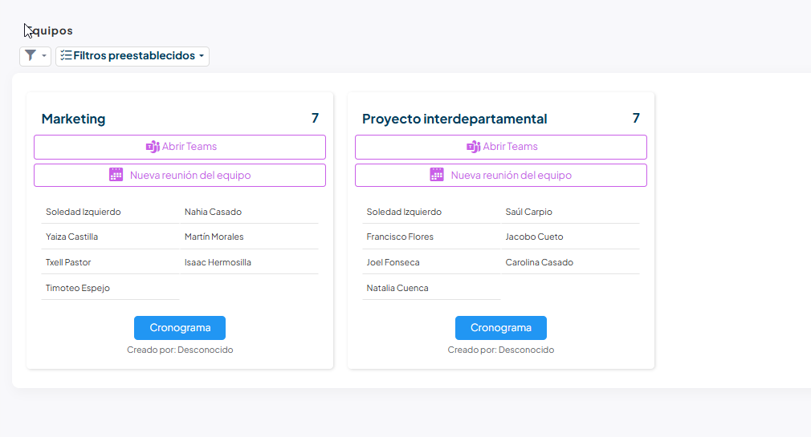

# Mi equipo

Un equipo es una agrupación de personas que puede juntar a gente de distintas unidades
y centros. Puedes estar en varios a la vez y también crear los tuyos.

En este artículo verás dónde consultar tus equipos, qué te ofrece cada uno y cómo
crear uno nuevo.

## ¿A qué equipo pertenezco?

Ve a **Área personal > Equipos**. Verás una tarjeta por cada equipo del que formas
parte, con su nombre, el número de personas que lo componen, la lista de esas personas y,
abajo, **Creado por**. Si el equipo es **Privado**, junto al nombre aparece un icono de
ojo tachado.

Solo aparecen tus equipos: aquellos en los que estás y los que hayas creado tú. Con los
filtros de la lista cambias entre **Equipos activos**, que es lo que ves de entrada, y
**Equipos deshabilitados**.

Cada tarjeta trae además unos botones:

- **Línea de tiempo** — abre una cronología con las vacaciones y ausencias de las
  personas del equipo.
- **Abrir Teams** y **Nueva reunión del equipo** — abren Microsoft Teams con los
  miembros del equipo, para escribirles o para convocar una reunión. Solo aparecen si
  esas personas tienen correo registrado.
- **Vacaciones** — el resumen de vacaciones del año de todo el equipo. Solo lo ves si
  eres el responsable de ese equipo.

!!! tip "Si te llega una noticia que otros compañeros no ven"
    Tu empresa puede dirigir noticias y documentación solo a los miembros de un equipo
    concreto. Suele ser el motivo.

## ¿Cómo puedo crear equipos?

Puedes tener equipos propios. Si todavía no perteneces a ninguno, la lista de
**Área personal > Equipos** te lo ofrece directamente: pulsa el texto
**Equipos no existentes...** y se abre el formulario de un equipo nuevo.

De lo que te pide, lo único imprescindible es el nombre del equipo. Puedes indicar
también quién es su **Responsable** y, si te apetece, una imagen y un icono. Activa
**Privado** si no quieres que el equipo se muestre abiertamente.

Guarda el equipo y añade después a las personas desde el propio equipo, en el contador
**Equipos de empleados**.

!!! warning "Solo puedes tocar los equipos que has creado tú"
    Del equipo que creas eres el dueño: nadie más que tú —y Recursos Humanos— puede
    cambiarlo o borrarlo. Los equipos en los que solo estás como miembro los consultas,
    pero no los puedes modificar.

<!-- PENDIENTE: en la lista de Equipos, el botón Nuevo de la barra de herramientas está restringido por SQL a administradores y Recursos Humanos (toolbars_buttons.sql, emp_ListToolbar_Custom). Un empleado solo tiene la vía del texto "Equipos no existentes..." cuando la lista está vacía, aunque los permisos del objeto sí le dejan crear y ser dueño del equipo. ¿Se espera que el empleado cree equipos y desde dónde exactamente? -->

## Artículos relacionados

- [Mi unidad organizativa](mi-unidad-organizativa.md) — en qué se diferencia de un
  equipo y dónde está el organigrama.
- [Mi responsable](mi-responsable.md) — de quién dependes y qué aprueba.
- [Solicitud y cancelación](../ausencias-y-vacaciones/solicitud-y-cancelacion.md) — tus
  días y cómo pedirlos.
- [Mi planificación](../planificacion-de-turnos/mi-planificacion.md) — los turnos que
  pueden venir de tu equipo o de tu unidad.
