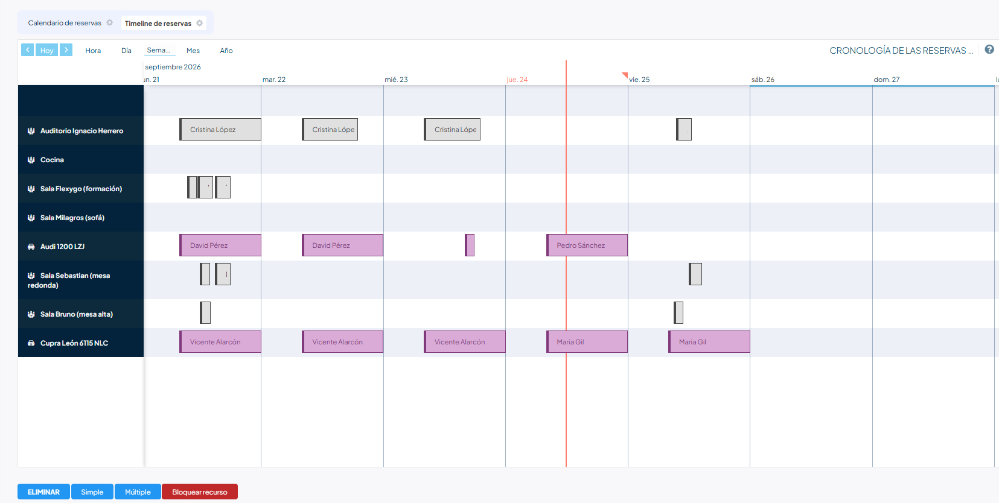

# Reservas

Cuando necesitas un recurso compartido de la empresa —una sala, un vehículo, un
equipo— lo coges tú mismo desde **Reservas**, comprobando antes en el calendario que
está libre.

En este artículo verás cómo reservar un recurso, cómo hacerlo para varios días de una
vez y cómo cancelar una reserva.

## ¿Cómo reservo un recurso de la empresa (sala, vehículo, equipo…)?

Entra en **Reservas**, comprueba en el calendario que el recurso está libre y pulsa
**Simple**.

1. En el menú principal, en el apartado **Información**, entra en **Reservas**.
2. Mira la disponibilidad. La pantalla tiene dos pestañas:
   **Calendario de reservas**, con las reservas colocadas por franjas horarias, y
   **Timeline de reservas**, que dedica una línea a cada recurso. En las dos ves las
   reservas de toda la empresa, con el nombre del recurso y de quien lo tiene cogido.
3. Pulsa **Simple**.
4. Elige el **Recurso** y la **Fecha de reserva**, y acota la franja con la
   **Hora de inicio** y la **Hora de finalización**, o activa **Todo el día**. Si el
   recurso tiene tipos de reserva definidos, elige el que corresponda en **Tipo**.
5. Guarda.

El **Estado** no lo rellenas tú: toda reserva nueva queda como **Activo**.

!!! warning "Dos reservas no pueden solaparse sobre el mismo recurso"
    Si alguien ya tiene ese recurso cogido en esa franja, la reserva no llega a
    guardarse y te avisa de que la fecha y la hora no están disponibles. Ojo con
    **Todo el día**: ocupa la jornada entera, así que choca con cualquier otra reserva
    de ese recurso ese día.

Pulsa cualquier reserva del calendario o del timeline para abrirla. Solo puedes
modificar las que has hecho tú.

### Reservar varios días de una vez

El botón **Múltiple** hace la misma reserva en todos los días de un periodo. Además del
recurso, el tipo y la franja horaria, te pide la **Fecha de reserva** y la
**Fecha de finalización de la reserva**, y te deja restringir los días: desactiva
**Todos los días de la semana** y elige cuáles en **Días de la semana**.

!!! info "Si un solo día da conflicto, no se guarda ninguno"
    Antes de crear nada comprueba el periodo entero. Si alguna fecha choca con otra
    reserva del mismo recurso, cancela la operación completa y te muestra la lista de
    días en conflicto para que ajustes las fechas y lo vuelvas a intentar.

También puedes repetir una reserva ya hecha: ábrela y busca **Repita las reservas** en
el menú de procesos de la barra superior. Ahí indicas cada cuánto se repite
(**Modo**), cuántas veces (**Cantidad**) y si quieres saltarte los fines de semana
(**Sin fin de semana**).

<!-- PENDIENTE: el combo Modo de "Repita las reservas" sale sin traducir al español (Daily / Weekly / Monthly) y el propio proceso se llama "Repita las reservas". ¿Lo documento tal cual, o lo dejo fuera hasta que se corrijan las etiquetas? -->

### Cancelar una reserva

Si todavía no ha empezado, puedes cancelarla tú:

- **Una reserva suelta**: ábrela desde el calendario o el timeline y pulsa
  **Cancelar** en la barra de botones. Te pide confirmación.
- **Varias a la vez**: en la pantalla de **Reservas**, pulsa **Eliminar**. Elige los
  recursos, el periodo entre la **Fecha de inicio** y la **Fecha Fin** y, si solo
  quieres cancelar algunos días, los **Días de la semana**.

!!! warning "Una reserva que ya ha empezado no se puede cancelar"
    Si la hora de inicio ya ha pasado, el botón te avisa de que la reserva ya ha
    comenzado y no hace nada. Habla con Recursos Humanos si necesitas liberarla.

La reserva cancelada desaparece del calendario y del timeline, y el recurso vuelve a
quedar libre en esa franja.

## Artículos relacionados

- [Viajes](viajes.md) — cómo solicitar un viaje de empresa.
- [Gastos](gastos.md) — cómo pasar los gastos que has adelantado.
- [Solicitud, seguimiento y validación](../instancias-y-solicitudes/solicitud-seguimiento-y-validacion.md) —
  para pedir a Recursos Humanos lo que no puedes hacer tú.
