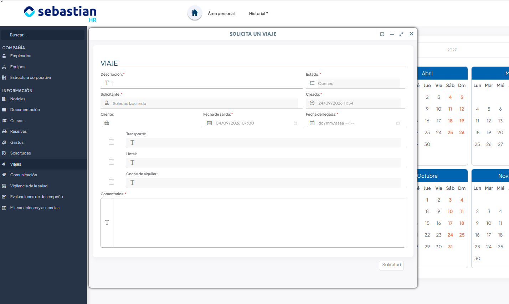

# Viajes

Cuando tienes que desplazarte por trabajo, pides el viaje desde **Viajes** y quien
lleva los viajes en tu empresa se encarga de las reservas.

En este artículo verás cómo solicitar un viaje y qué ocurre desde que lo pides hasta
que se cierra.

## ¿Cómo solicito un viaje de empresa?

Entra en **Viajes** y pulsa el día en el que sales. Se abre el formulario de solicitud
con esa fecha ya puesta.

1. En el menú principal, en el apartado **Información**, entra en **Viajes**.
2. Verás un calendario anual con los viajes en los que participas. Pulsa un día libre.
3. Pon una **Descripción** del viaje y, si va asociado a alguien, el **Cliente**.
4. Ajusta la **Fecha de salida** y la **Fecha de llegada**.
5. Marca lo que necesitas que te reserven —**Transporte**, **Hotel**,
   **Coche de alquiler**— y escribe al lado los detalles de cada cosa: horarios que te
   vienen bien, categoría, número de plazas…
6. Usa **Comentarios** para el resto de la información del viaje.
7. Pulsa el botón de solicitud.

!!! info "No puedes tener dos viajes solapados"
    Si ya tienes un viaje que pisa esas fechas, la solicitud no se guarda. Y la fecha
    de llegada no puede ser anterior a la de salida.

### Qué pasa después de solicitarlo

El viaje queda en estado **Abierto** y le llega un aviso, y un correo, a quien lleva los
viajes en tu empresa. A partir de ahí:

- Pulsa el viaje en el calendario para abrirlo. Arriba tienes las fechas, el cliente,
  el estado y lo que pediste en cada apartado.
- Según se vayan cerrando, aparecen las reservas concretas en los bloques de
  **Transporte**, **Hotel** y **Coche de alquiler**, con el tipo, las fechas y si es ida
  y vuelta.
- En **Compañeros de viaje** ves quién más va. Tú apareces desde el primer momento; al
  resto los añade quien gestiona el viaje.
- En **Documentos de viaje** puedes adjuntar lo que necesites y descargarte lo que
  hayan subido: billetes, reservas, justificantes.

Cuando el viaje se marca como **Cerrado** recibes un correo con toda la documentación
del viaje adjunta. Si al final no se hace, pasa a **Cancelado**.

<!-- PENDIENTE: el detalle del viaje trae un botón "Administrar". ¿Lo usa también quien ha solicitado el viaje (para completar sus reservas), o es solo para el responsable de viajes y no debería documentarse? -->

En el calendario solo salen los viajes que has pedido tú y aquellos en los que te han
incluido como compañero de viaje.

## Artículos relacionados

- [Gastos](gastos.md) — cómo pasar los gastos del viaje.
- [Reservas](reservas.md) — cómo coger una sala, un vehículo o un equipo.
- [Fichar](../fichajes/fichar.md) — cómo fichar los días que estás de viaje.
- [Solicitud y cancelación](../ausencias-y-vacaciones/solicitud-y-cancelacion.md) — un
  viaje de trabajo no es una ausencia: se piden por sitios distintos.
